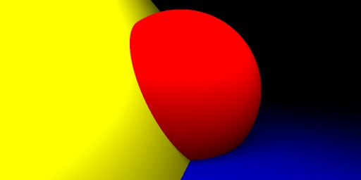
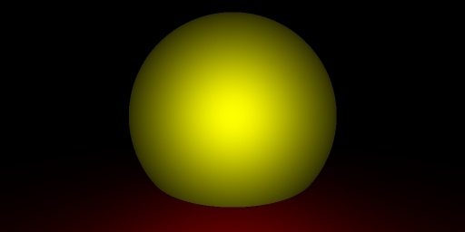

# TP noté - Synthèse d'images 2022/2023

## Dependencies

- Python 3.9+
- OpenCV 4.7+
- CMake 3.21+

## How to run
- In CLion : 
    - To run the program :
      - Load CMakeLists.txt
      - Click on run to launch `synthese`
    - To run test :
      - Add a configuration to run `Google_Tests_run`

- In terminal :
    - `mkdir build && cd build`
    - `cmake ..`
    - `make`
    - `./synthese`
## Folder structure
- `.cpp` in `src/customs`
- `.h` in `include/customs`
- Script Python to resize the image in `resize_script`
- CMake at `.CMakeLists.txt`

## What is done

- Code totalement orienté objet
  -  Classe abstraite : Drawable
  - Classes pour tous les éléments nécessaires au rendu
    - Point d'intersection, Lumières, Rayons, etc.
- Plusieurs sources de lumière :
  - Spot (panneau)
  - Ponctuelle
- Rendu d'une scene 3D avec les formes suivantes :
  - Sphere
  - Plan
  - Panneau
- Ombres
- Antialiasing : Lissage de l'image en générant plusieurs rayons par pixel : on génère une image plus grande, puis on la réduit à l'aide d'un script Python avec OpenCV

## Improvements to be made
- Les spots ne semblent pas se rotationner correctement
- Reflets
- Transparence

## Difficulties and tries
- Nous avons testé de faire des reflets, mais nous n'avons pas réussi à les faire fonctionner correctement, notamment à cause de la classe `Intersection` qui devait être modifiée pour prendre en compte les reflets.  
- Nous avons aussi essayé de faire d'autres formes, comme un cube, à l'aide de plusieurs plans, mais le rendu n'était pas satisfaisant.

## Wants
- Nous aimerions voir comment bouger la caméra en temps réel, pour pouvoir naviguer dans la scène.
- Nous aurions aimé voir comment faire des textures sur les objets, au-delà de la couleur.
- Nous aurions aimé que le cours soit plus concret, avec des exemples de code, et plus de détails sur les algorithmes utilisés.
- Nous aurions aimé que les TPs encouragent plus de code propre.

## Render examples
### Render 1
Sol bleu (plan), panneau jaune en collision avec une sphère rouge, une lumière spot blanche.

</a>

### Render 2
Sol rouge (plan), sphère jaune,  une lumière ponctuelle blanche.

</a>